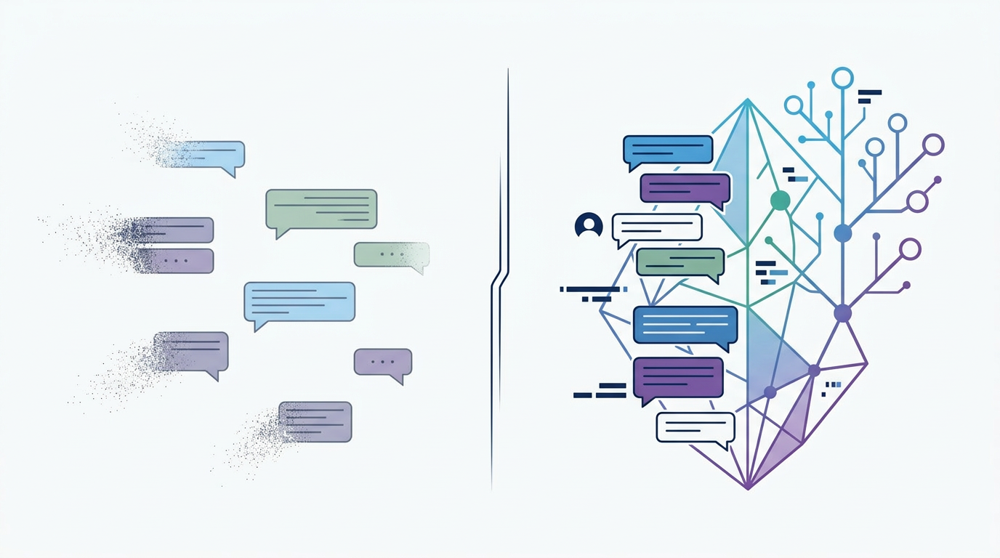
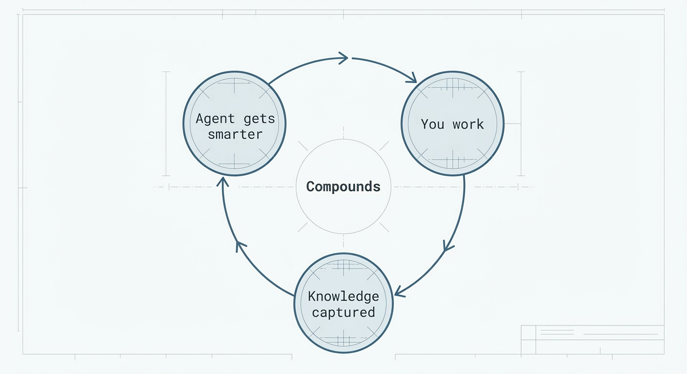

<p align="center">
    
</p>

**MonoClaw** turns your monorepo into a personal AI assistant. Your AI coding agent(Claude Code, Codex, etc) is a genius with amnesia. Every session starts from zero — it doesn't know your architecture decisions, your meeting takeaways, your research findings, or the priorities you've been refining for months. You keep re-explaining. Nothing compounds.

**This repo fixes that.** Clone it, open it in Claude Code, and it becomes a personal agent that accumulates knowledge across everything you do — not just coding, but research, meeting analysis, writing, decision-making. The 50th session is categorically different from the 5th.
<p align="center">
  
</p>

## What It Looks Like

**Without this** — every session is a stranger:
```
You: Let's continue the auth migration we discussed last week.
AI:  I don't have context about a previous auth migration discussion.
     Could you provide more details about what was decided?
```

**With this** — the agent knows your history:
```
You: Let's continue the auth migration.
AI:  Based on our March 3 discussion, we decided on JWT with refresh token
     rotation. Open question was batch vs. all-at-once user migration —
     your concern was the 2-hour maintenance window. Pick up from there?
```

It's not just code context. Drop a meeting transcript and ask for analysis — the agent cross-references it with your prior meetings, your team's priorities, your stated values. Ask it to research a vendor — it remembers what you learned about similar vendors last month.

## Features

- 🧠 **Three-layer memory** — sessions → distilled knowledge → long-term identity, all in plain markdown
- 🔬 **Deep research** — parallel sub-agents with cross-validation and contradiction flagging
- 🎯 **Meeting analysis** — power dynamics, hidden negotiations, follow-up risks from any transcript
- ✍️ **Doc co-authoring** — structured brainstorming → drafting → reader testing workflow
- 🔍 **Semantic search** — embedding-based retrieval across your entire knowledge base
- ⚙️ **Automated maintenance** — weekly distillation, monthly reflection, all on schedule

## Quick Start

```bash
git clone <this-repo> && cd MonoClaw
```

Open in Claude Code (or OpenCode, Codex, Cursor). The agent reads `CLAUDE.md`, detects a fresh setup, and walks you through onboarding conversationally. That's it.

## How It Works

Every session, your agent reads accumulated context from a structured monorepo:

<details>
<summary>Repository structure</summary>

```
MonoClaw/
  ├── CLAUDE.md          How the agent thinks and behaves
  ├── memory/
  │   ├── index.md       Entry point — loaded every session
  │   ├── raw/           Session extractions (immutable logs)
  │   ├── curated/       Distilled knowledge (weekly automated)
  │   └── insights/      Long-term identity (you approve changes)
  ├── contexts/          Meeting transcripts, research → memory pipeline
  ├── docs/              Design docs, specs (co-authored with AI)
  ├── jobs/              Automated distillation + reflection schedules
  └── .claude/skills/    6 pluggable capabilities (research, meetings, etc.)
```

</details>

The agent loop produces knowledge. The repo captures it. Richer context feeds better output.

<p align="center">
  
</p>

**It's a flywheel** — not just across sessions, but across everything you curate: meetings, research, reading notes, decisions, design docs.

## Learn More

- **[Why this architecture](docs/why-this-architecture.md)** — the full thesis on agent loops + monorepos as a reinforcing system
- **[Memory system design](docs/memory-system-design.md)** — three-layer architecture, design principles, data flow
- **[Skills & jobs reference](docs/skills-and-jobs.md)** — what's included, how to add your own

## Requirements

- **Claude Code, OpenCode, Codex, or Cursor** — any agent that reads `CLAUDE.md`
- **Python 3.11+** — for the job runner (optional)
- **macOS** — for launchd scheduling (Linux: adapt to cron/systemd)

## Contributing

PRs welcome. See [CONTRIBUTING.md](CONTRIBUTING.md).

## License

[MIT](LICENSE) — fork it, make it yours, let it compound.
